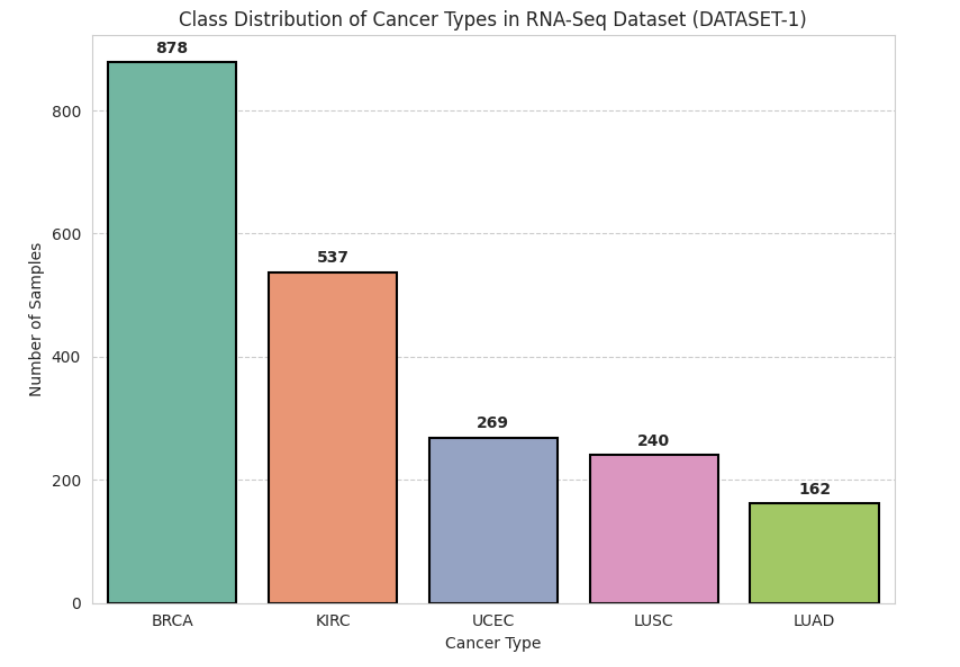

# 🧬 Cancer Prediction Model using Dimensionality Reduction techniques and RNN-CNN Classifier

This project replicates and enhances a research paper titled **"RNN-CNN Based Cancer Prediction Model for Gene Expression"**. The paper proposed a hybrid deep learning model combining **Recurrent Neural Networks (RNNs)** and **Convolutional Neural Networks (CNNs)** for cancer prediction using gene expression data. However, the original implementation showed low accuracy, prompting us to explore **feature selection** and **feature extraction** techniques to improve model performance.

---

## 📚 Overview

- **Domain**: Bioinformatics / Medical AI  
- **Task**: Cancer prediction from gene expression data  
- **Techniques Used**: RNN, CNN, Feature Selection, PCA, Autoencoders, Genetic Algorithms 
- **Language**: Python  
- **Libraries**: NumPy, Pandas, TensorFlow/Keras, Scikit-learn, Matplotlib  

---

## 🧪 Dataset

- **Source**: [Dataset-1](https://github.com/Sonali9867/Cancer_Prediction_Model/blob/main/DATASET-1.csv)
- **Format**: CSV file with rows as samples and columns as gene expression features + target label
- **Shape**: 2086 rows × 972 columns (971 gene expression features + 1 target label)
- **Target**: Cancer type
- **Classes** (5 types):
  - BRCA: Breast Invasive Carcinoma
  - KIRC: Kidney Renal Cell Carcinoma
  - LUAD: Lung Adenocarcinoma
  - LUSC: Lung Squamous Cell Carcinoma
  - UCEC: Uterine Corpus Endometrial Carcinoma

Each row in the dataset represents a patient sample, and the columns represent normalized RNA-Seq gene expression levels for 971 genes. The final column contains the corresponding cancer type.

### 🖼️ Sample Preview

### 🖼️ Sample Preview

---

## 🔍 Approach

### 1️⃣ Baseline Model (from paper)

- Implemented RNN-CNN model architecture as described
- Used raw gene expression data
- **Result**: Accuracy ~65%

### 2️⃣ Enhancements Applied

#### 🔹 Feature Selection
- ANOVA F-test
- Chi-square
- Recursive Feature Elimination (RFE)

#### 🔹 Feature Extraction
- PCA (Principal Component Analysis)
- Autoencoders (deep learning-based compression)

### 3️⃣ Final Model

- **Input**: Reduced and selected gene features
- **Architecture**:
  - 1D CNN Layers (spatial feature extraction)
  - GRU / LSTM Layers (sequence learning)
  - Dense Layers for classification
- **Output**: Binary or multi-class cancer prediction

---

## 📈 Results

## 🖼️ Screenshots

### 📊 Accuracy and Loss Curves

### 📉 Confusion Matrix

### 🔍 Feature Importance or PCA Plot

> All visualizations are stored in the `/results/` folder.

